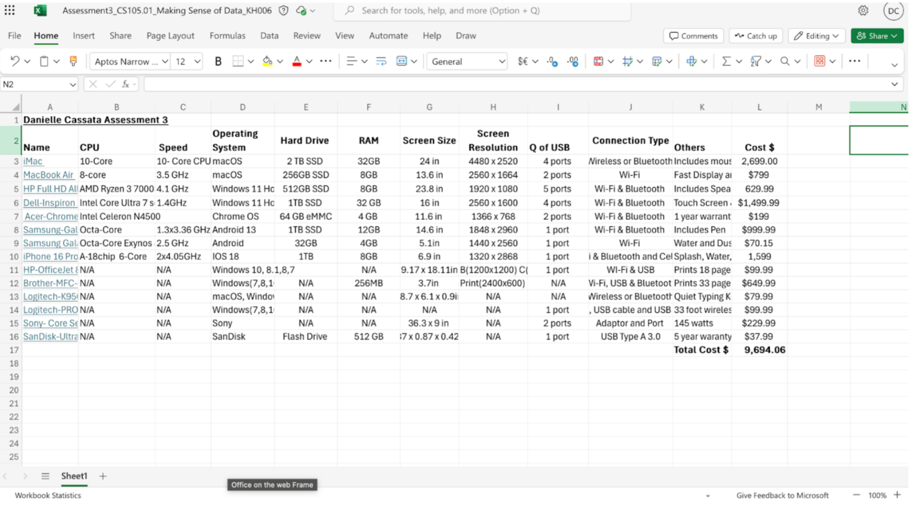
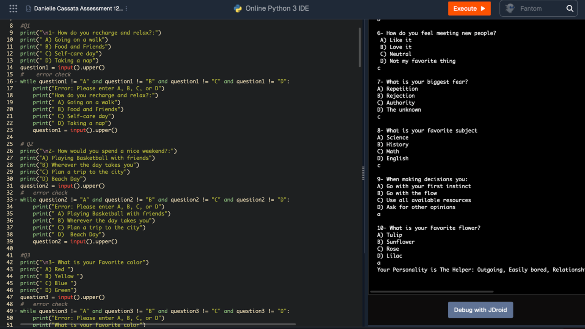
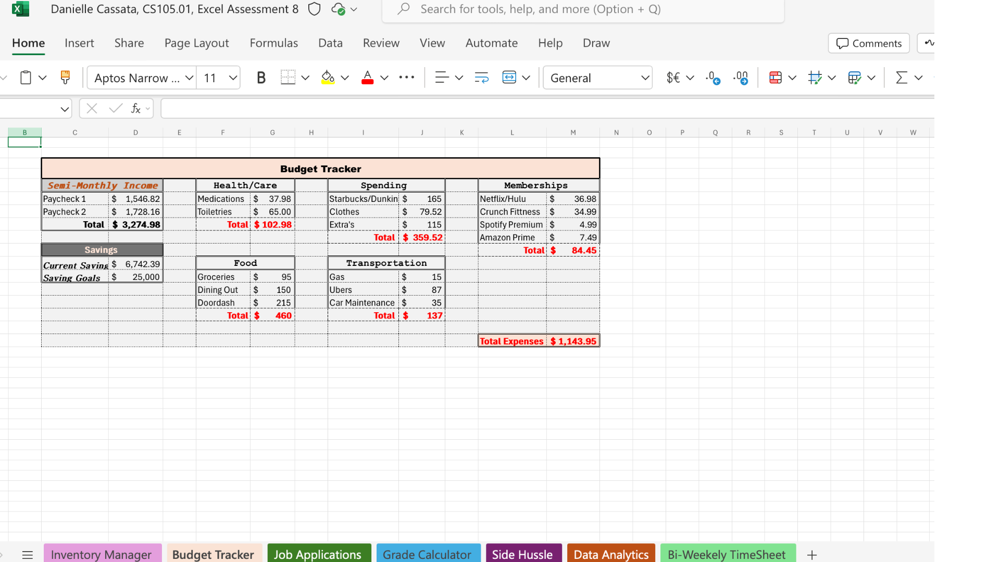

***

# Danielle Cassata 
- 
# About Me
   - Hello! I am a current student and para-professional with over 2 years of proven expertise in early childhood education and special education.
   - With skills in problem solving, strategically analyzing data, programming in Python, and financial management in Excel, I am able to organize student file databases that contain 25GB of data and achieve accurate financial data. I am adept at using Excel, Python, and Microsoft Access. 
   - My diligent skill set, commitment to education, and passion for children make me a valuable asset. In my spare time, I like to play musical instruments and go swimming.
  - You can find me on [LinkedIn](https://www.linkedin.com) or @daniellecassata04 .

***

# Education 
I am currently in my Junior Year at Loyola University Maryland 

***

# Projects

# Technology Excel 

-
 - In this project, I had a list of items given to me along with which specifications of each item in order to help display an easier view of everything. I used Microsoft Excel and made a spreadsheet showing the specs for each item, including CPU speed, Memory, etc. I was able to learn better organization in Excel throughout my first steps into really using Excel ever.

# Personality Test 
-
 - In this project, I created a personality test that categorizes the user into different personality types based on the input from the user. I was able to create a code that implemented different functions on Python 3, such as error checking and if/ elif statements, to display the questions I created. As well as calculating the results carefully and accurately. It was important for me to execute the code multiple times and find the errors made along the way in order to complete this project.

# Budget Tracker 
 -
 - In this project, I had to create a budget tracker to help stay on top of finances, expenses, and income. Being able to keep it organized by using certain functions to keep it as organized as possible. I again used Microsoft Excel, opened up a spreadsheet, and created a table with the function for pricing. I worked on this project myself to challenge myself a bit before learning the controls and functions of Excel.

